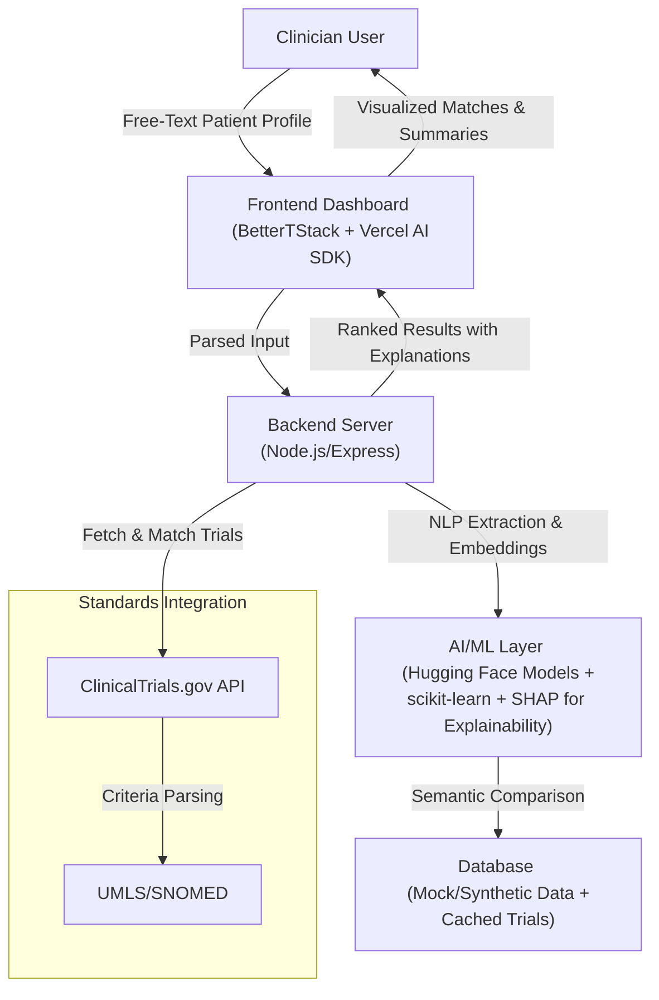

# Clinical Trial Patient Match Co-Pilot

## Overview
This project is a prototype for Hackathon 01, an AI-powered web app that helps clinicians quickly match patients to clinical trials using free-text profiles. Built using AI coding agents (e.g., Cursor with Vercel AI SDK), it demonstrates AI nativeness through NLP for input parsing, semantic matching, and explainable ML. The app is web-based, deployed on Vercel, and uses the BetterTStack framework for fast development.

## Problem Statement
Clinical trial matching is slow, opaque, and inefficient:
- Patients miss opportunities due to lack of awareness and complex criteria.
- Clinicians lack tools to scan trials during consultations, relying on manual reviews.
- Trials face 80% enrollment delays, costing billions in recruitment.

Focused problem: Enable clinicians to input real-world patient profiles (messy free-text) and get transparent, explainable trial fits to discuss with patients. This targets the clinician bottleneck, where providers influence most enrollments but waste time on jargon-heavy criteria.

## Existing Solutions
- **Tempus**: AI pre-screening from EMRs, oncology-focused; provider-oriented but not ad-hoc for free-text.
- **BEKhealth**: Matches from EMRs, identifies 10x more patients; strong for sites but privacy-heavy and not clinician-conversation ready.
- **TrialX**: NLP matching for patients; form-based, lacks explainability for clinicians.
- **Antidote.me**: Questionnaire-driven; patient-facing, static, no messy text handling.
- **Inspirata Trial Navigator**: Automates with NLP/EHR; efficient but not transparent or clinician-centric.

Gaps: Most are form/EMR-based, lack explainable AI for free-text, and don't empower clinicians for real-time use.

## Our Solution
### Primary User
Clinicians (e.g., oncologists) during patient consultations.

### Specific Problem Solved
Clinicians input free-text patient profiles; AI provides instant trial matches with explanations, speeding up referrals and reducing opacity.

### Key Features
- **Free-Text Input**: Parse messy notes (e.g., "45yo female, breast cancer stage II, HER2+").
- **AI Matching**: NLP extraction (Vercel AI SDK), semantic embeddings (Hugging Face) on ClinicalTrials.gov data, ML ranking (scikit-learn) with explainability (SHAP).
- **Output**: Ranked trials, match scores, explanations (e.g., "Excludes due to age"), and visuals.
- **Empathy/UX**: Simple dashboard with one-click patient summaries; focuses on time-saving for busy docs.
- **Data**: ClinicalTrials.gov API, UMLS/SNOMED for terms, synthetic mocks via Faker/BioPython.

### Why Our Solution is Great and Differentiated
- **Novelty**: Explainable AI for free-text—beyond black-box tools; clinician-focused for systemic impact.
- **Problem Research**: Addresses 80% delay stat by targeting referrals; gaps in clinician tools per industry reports.
- **UX & Empathy**: Intuitive interface understands clinician workflows (e.g., "Scan in 30s").
- **Technical Execution**: Meaningful AI/ML; works with public data.
- **Communication**: Justified scope (oncology/US) for high-volume impact.

### Success Looks Like
- Quick matches (<30s) with 80%+ accuracy on mocks.
- Demo: End-to-end flow for a synthetic patient.

### Future Features (Post-Hackathon)
- EHR integration (e.g., Epic) for auto-input.
- Real-time trial alerts via PubMed.
- Sponsor dashboard for recruitment analytics.
- Patient self-service mode.
- Advanced ML: Train on enrollment data for predictive matching.

## System Architecture


## Getting Started

1. Install dependencies:
```bash
npm install
```

2. Copy `.env.example` to `.env` and add your API keys:
```bash
cp .env.example .env
```

3. Run the development server:
```bash
npm run dev
```

4. Open [http://localhost:3000](http://localhost:3000) in your browser.

## Tech Stack

- **Framework**: Next.js 14 (App Router)
- **Language**: TypeScript (strict mode)
- **Styling**: Tailwind CSS
- **AI Integration**: Vercel AI SDK
- **Code Style**: Airbnb ESLint config

## Project Structure

```
src/
├── app/          # Next.js pages (App Router)
├── components/   # Reusable UI components
├── api/          # Backend API routes
├── ai/
│   └── prompts/  # AI prompt templates for LLM calls
│       ├── extractPatientProfile.ts  # Parse free-text to structured data
│       └── assessTrialFit.ts         # Evaluate patient-trial matches
├── types/        # TypeScript interfaces and types
└── ...
docs/
└── ai-design.md  # AI usage, limitations, and safety guidelines
```

## Development

- `npm run dev` - Start development server
- `npm run build` - Build for production
- `npm run start` - Start production server
- `npm run lint` - Run ESLint
