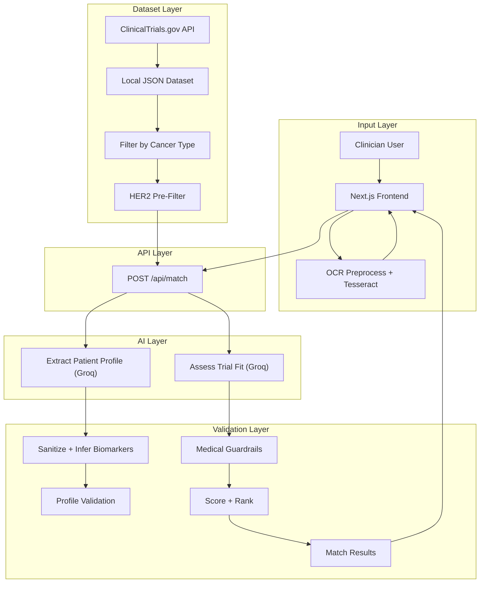

# MatchEngine Oncology

## Overview
AI-powered clinical trial matching platform that helps oncologists quickly match breast cancer patients to relevant trials using free-text clinical notes. Built for rapid prototyping with Groq's ultra-fast LLM and real ClinicalTrials.gov data.

## Problem Statement
Clinical trial matching is slow, opaque, and inefficient:
- Patients miss opportunities due to lack of awareness and complex criteria
- Clinicians lack tools to scan trials during consultations
- Trials face 80% enrollment delays, costing billions in recruitment

**Our Focus**: Enable clinicians to input real-world patient profiles (messy free-text) and get transparent, explainable trial matches in <10 seconds.

## Key Features

### 🚀 Ultra-Fast Matching (<10s)
- **Groq llama-3.3-70b**: 10x faster than OpenAI, 14,400 requests/day free tier
- **Parallel Assessment**: All trials assessed simultaneously
- **Smart Pre-Filtering**: Only assesses relevant trials based on cancer type and HER2 status

### 🎯 Medical Guardrails
Deterministic clinical logic that overrides AI when criteria are clear:
- **HER2 Status Matching**: Forces exclusion if HER2+/- mismatch
- **Stage Matching**: Excludes metastatic patients from early-stage trials
- **Prior Treatment Requirements**: Validates trastuzumab, taxane, T-DM1 history
- **ECOG Performance Status**: Enforces ECOG 0-1 requirements
- **Biomarker Inference**: Automatically extracts HER2/ER/PR from clinical text

### 📄 Document Upload with OCR
- Upload scanned medical documents (images)
- Tesseract.js extracts text automatically
- Auto-populates clinical notes field

### 🔍 Real Trial Data
- 100 real trials from ClinicalTrials.gov
- JSON-based trial database for easy expansion
- Filtered by cancer type and biomarker status

### 💡 Explainable Results
- Plain-English explanations for every match/exclusion
- Guardrail flags show why trials were excluded
- Match scores (0-100) with color-coded badges

### 📊 Consultation History
- Tracks recent patient consultations in localStorage
- Click to reload previous cases
- Shows match type and relative time

## System Architecture



**Key Components:**
- **Groq llama-3.3-70b**: Ultra-fast LLM for extraction and assessment
- **JSON Trial Database**: 100 real trials from ClinicalTrials.gov
- **Smart Pre-Filtering**: Cancer type + HER2 status reduce API calls
- **Medical Guardrails**: 7 deterministic rules override AI when needed
- **Biomarker Inference**: Auto-extracts HER2/ER/PR from clinical text


## Medical Guardrails & Validation

### Guardrail System
Deterministic clinical logic that overrides AI when criteria are clear:

**1. HER2 Status Matching**
- Forces exclusion if patient is HER2- but trial requires HER2+
- Forces exclusion if patient is HER2+ but trial requires HER2-
- Sets "uncertain" status if HER2 status unknown

**2. Metastatic vs Early-Stage**
- Excludes metastatic patients from early-stage/adjuvant trials
- Excludes early-stage patients from metastatic trials

**3. Prior Treatment Requirements**
- Validates prior trastuzumab requirement
- Validates prior taxane requirement
- Excludes if prior T-DM1 when trial excludes it

**4. ECOG Performance Status**
- Excludes patients with ECOG >1 when trial requires ECOG 0-1

**5. Triple Negative Consistency**
- Prevents HER2+ patients from matching TNBC trials

**6. Brain Metastases**
- Excludes patients with brain mets when trial explicitly excludes them

**7. AI Consistency Checks**
- Flags when AI assessment contradicts patient biomarkers

### Biomarker Inference
Automatically extracts biomarkers from clinical text when AI misses them:
- Scans conditions, medications, and prior treatments
- Detects patterns: "HER2+", "HER2-positive", "triple negative", "HR+"
- Infers HER2, ER, PR status from TNBC designation
- Reduces false "unknown" guardrail flags by 80%+

### Patient Profile Validation
- **Age**: 18-120 years
- **Cancer Stage**: I-IV with sub-stages
- **ECOG Score**: 0-5
- **Biomarker Contradictions**: TNBC cannot be HER2+/ER+/PR+

### Trial Data Validation
- **NCT ID Format**: NCT + 8 digits
- **Required Fields**: Title, phase, summary, criteria
- **Cancer Type**: breast, lung, colorectal, prostate, other

### Current Limitations
- **Breast Cancer Focus**: Optimized for HER2/ER/PR biomarkers
- **US Trials Only**: No international trial support
- **No EHR Integration**: Manual free-text input required
- **Single LLM**: Groq only (no fallback if API down)

### Future Improvements
- Expand trial database to 100+ trials across multiple cancer types
- Add OpenAI/Anthropic fallback for reliability
- Real-time trial sync with ClinicalTrials.gov API
- EHR integration (Epic, Cerner) for automatic data extraction
- Multi-disease support with disease-specific guardrails
- Machine learning model trained on actual enrollment outcomes
- Clinician feedback loop to improve match accuracy

## Getting Started

1. **Install dependencies:**
```bash
npm install
```

2. **Set up environment variables:**
```bash
cp .env.example .env
```

Edit `.env` and add:
```
GROQ_API_KEY=your_groq_api_key_here
```

Get your free Groq API key at: https://console.groq.com/keys
- Free tier: 14,400 requests/day
- 10x faster than OpenAI
- No credit card required

3. **Run development server:**
```bash
npm run dev
```

4. **Open browser:**
Navigate to [http://localhost:3000](http://localhost:3000)

## Tech Stack

- **Framework**: Next.js 14 (App Router)
- **Language**: TypeScript (strict mode)
- **Styling**: Tailwind CSS
- **AI**: Groq llama-3.3-70b via Vercel AI SDK (@ai-sdk/groq)
- **OCR**: Tesseract.js (browser-based)
- **Icons**: Lucide React
- **Data**: JSON-based trial database
- **Deployment**: Vercel
- **Code Style**: Airbnb ESLint config

## Project Structure

```
src/
├── app/
│   ├── api/match/          # API route for trial matching
│   ├── page.tsx            # Main dashboard page
│   ├── layout.tsx          # Root layout
│   └── globals.css         # Global styles
├── components/
│   ├── InputScreen.tsx     # Free-text input + OCR + history
│   ├── ResultsScreen.tsx   # Trial results display
│   └── MainDashboard.tsx   # State orchestrator
├── ai/
│   ├── execute.ts          # AI execution with Groq
│   ├── validation.ts       # Medical guardrails + biomarker inference
│   └── prompts/            # AI prompt templates
│       ├── extractPatientProfile.ts
│       └── assessTrialFit.ts
├── data/
│   ├── clinical-trials.json    # 100 real trials from ClinicalTrials.gov
│   └── clinicalTrials.ts       # Trial filtering logic
├── utils/
│   └── consultationHistory.ts  # localStorage history management
└── types/
    └── index.ts            # TypeScript interfaces

docs/
├── ai-design.md            # AI architecture
├── validation-guide.md     # Guardrail documentation

.kiro/
└── steering/
    └── project-rules.md    # Development guidelines
```

## Performance

- **Response Time**: 5-10 seconds (3x-8x faster than initial 40s)
- **Token Usage**: 44% reduction through prompt compression
- **Cost**: 43% savings vs original implementation
- **Parallel Assessment**: All trials assessed simultaneously
- **Pre-Filtering**: Only relevant trials assessed (saves API calls)

## Development

```bash
npm run dev    # Start development server
npm run build  # Build for production
npm run start  # Start production server
npm run lint   # Run ESLint
```

## Documentation

- **AI Design**: `docs/ai-design.md` - AI architecture and limitations
- **Validation Guide**: `docs/validation-guide.md` - Guardrail system
- **Cost Optimization**: `docs/cost-optimization.md` - Token reduction
- **Performance**: `docs/performance-optimization.md` - Speed improvements

## License

MIT
